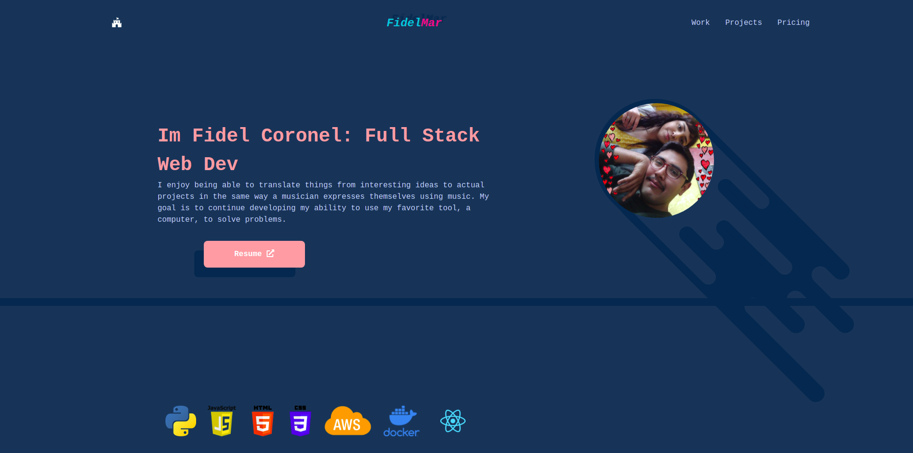

# Portfolio 3
Built using JS, HTML, CSS/SASS



Setup using Tailwind, Parcel and Babel
```
npm init -y
git init
npm i -D parcel-bundler sass @babel/core @babel plugin-transform-runtime @babel/runtime-corejs2
```


## Setting up AWS S3 pipeline
[Towards AWS](https://towardsaws.com/build-a-simple-devops-pipeline-from-github-to-aws-s3-for-static-website-911c620dce31)